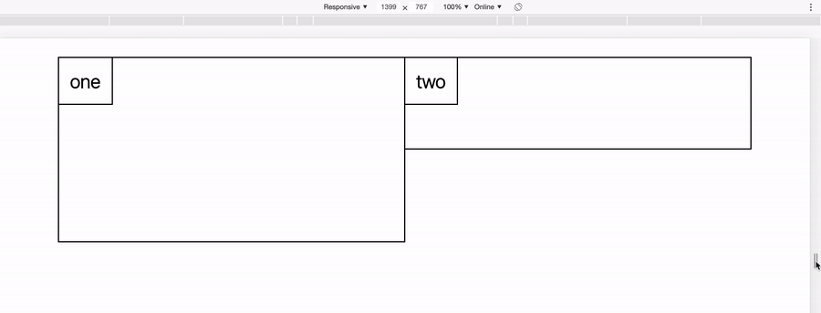

# @include fl()

Fluid values using ratios between a min and max screen width.



## Setup

Begin by defining the default config;

For ratio suggestions use [modularscale.com](https://www.modularscale.com/).

```scss
$fl-screen-min: 48rem;
$fl-screen-max: 100rem;

/**
 * https://www.modularscale.com/
 *
 * 1.125 major second
 * 1.25 major third
 * 1.333 perfect fourth
 * 1.5 perfect fifth
 * 1.618 golden ratio
 * 2 octave
 */
$fl-ratio: 1.618;
```

## Usage

The mixin accepts the following parameters;

```scss
@include fl($props, $max-value, $ratio: $fl-ratio, $screen-min: $fl-screen-min, $screen-max: $fl-screen-max);
```

`$ratio`, `$screen-min` and `$screen-max` are optional and will otherwise use the default config.

```scss
// margin-bottom of 10rem at screen width $fl-screen-max downscaling by $fl-ratio until a screen width of $fl-screen-min
@include fl(margin-bottom, 10rem);
```

```scss
// passing two props works
@include fl(margin-bottom margin-top, 50px);
```

```scss
// margin-bottom of 10rem at screen width 75rem downscaling by 1.5x until a screen width of 36rem
@include fl(margin-bottom, 10rem, 1.5, 36rem, 75rem);
```

```scss
// negative ratios result in a larger value when downscaling
@include fl(margin-bottom, 5rem, -1.618);
```
