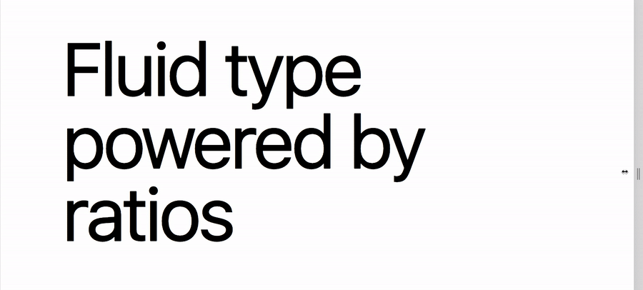

# @include fs()

Fluid type using ratios between a min and max screen width.



## Setup

Defining a default config is not required, but is recommended. 

For ratio suggestions use [modularscale.com](https://www.modularscale.com/).

```scss
$fl-screen-min: 48rem;
$fl-screen-max: 100rem;
$fl-ratio: 1.618;
```

```scss
// rem or px allowed
$font-sizes: (
  xs: (
    size: 0.75rem, // 12
    ratio: 1.125,
  ),
  sm: (
    size: 0.875rem, // 14
    ratio: 1.125,
  ),
  base: (
    size: 1rem, // 16
    ratio: 1.125,
  ),
  lg: (
    size: 1.125rem, // 18
    ratio: 1.125,
  ),
  xl: (
    size: 1.25rem, // 20
    ratio: 1.125,
  ),
  xx: (
    size: 1.5rem, // 24
    ratio: 1.25,
  ),
  xx1: (
    size: 1.875rem, // 30
    ratio: 1.333,
  ),
  xx2: (
    size: 2.25rem, // 36
    ratio: 1.333,
  ),
  xx3: (
    size: 3rem, // 48
    ratio: 1.5,
  ),
  xx4: (
    size: 4rem, // 64
    ratio: 1.5,
  ),
  xx5: (
    size: 5rem, // 80
    ratio: 1.618,
  ),
  xx6: (
    size: 6rem, // 96
    ratio: 1.875,
  ),
);
```

## Usage

The mixin accepts the following parameters;

```scss
@include fs($font-size, $ratio, $screen-min: $fl-screen-min, $screen-max: $fl-screen-max);
```

`$ratio`, `$screen-min` and `$screen-max` are optional and will otherwise use the default config.

```scss
// font-size of 1.5rem, downscaling by 1.25x until a screen width if $fl-screen-min
@include fs(xx);
```

```scss
// font-size of 1.5rem, downscaling by 1.618x until a screen width if $fl-screen-min
@include fs(xx, 1.618);
```

```scss
// custom font-size of 5rem, downscaling by 1.618x until a screen width if $fl-screen-min
@include fs(5rem, 1.618);
```

```scss
// custom font-size of 5rem at screen width 75rem downscaling by 1.618x until a screen width of 36rem
@include fs(5rem, 1.618, 36rem, 75rem);
```